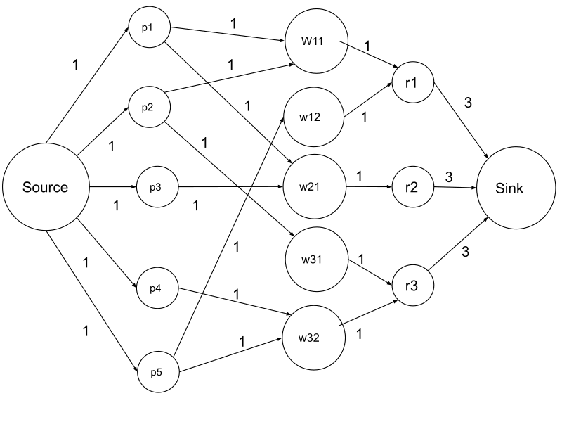

# Flow Graph

Flow Graph is a #[202204112118](202204112118.md) that depicts the networking flow. The starting
node is called a source (denoted $s$) whereas the ending node is called a sink
(denoted $t$). Each edge has **flow value** (how many *have* flowed through) and
**maximum capacity** (how much *can* flowed through), usually written in the
format flow value/maximum capacity.

The maximum capacity for an edge must not be negative. The flow value for the
edge should be less than or equal to the maximum capacity that it can allow, and
the flow value from every edge must be initialised to 0 before the
#[calculation](202206091105.md).

Somtimes, it will be incorporated into [202206091605](202206091605.md)#.
