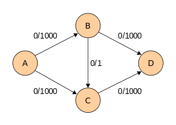

# Ford-Fulkerson Algorithm

Ford-Fulkerson Algorithm is a [202204151143](202204151143.md)# aim to solve #[202206091105](202206091105.md)
by repeatedly finds augmenting paths through the [202206091605](202206091605.md)# and augments
(updates) the flow until there is no [202206091601](202206091601.md)# to be found. It is
essentially finding the *bottlenecks*, that is the smallest maximum capacity in
the augmenting path, and sum them all together to get the maximum flow for the
#[202204112045](202204112045.md). [^williamfiset2018]

## Details

Augments (update) the flow means *updating* the *flow values* of the edges along
the [202206091601](202206091601.md)#. This can be done by simply increasing the flow to the
forward edges and decreasing the flow to the [202206091616](202206091616.md)# by the
*bottleneck value* (the smallest maximum capacity in the path).

## Analysis

Assuming this algorithm be implemented in #[202205021959](202205021959.md), the time complexity
will be $O(fE)$ where $f$ denotes the maximum flow and $E$ denotes the number of
edges. However, when meeting the worst case as shown below, if the algorithm
repeatedly choosing the edge with the smallest maximum capacity (in this case,
edge with a value of maximum capacity of 1), it will need 2000 steps to get the
maximum flow. This turn out to be a rather poor performance.

[^williamfiset2018]: Max Flow Ford Fulkerson | Network Flow | Graph Theory, 29
  Aug 2018 https://www.youtube.com/watch?v=LdOnanfc5TM
