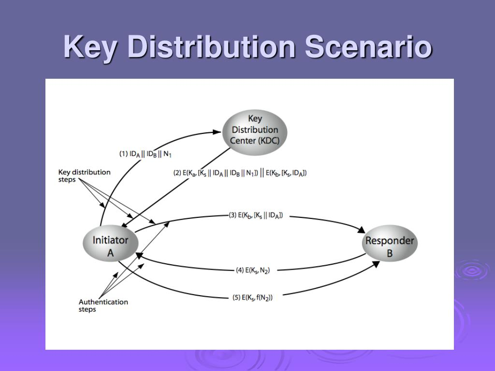

# Key Distribution Center (KDC)

KDC is where the user could request #[private key](202209012153.md) from the
other user. The scheme is shown as following:

Before distributing the public key to the user upon a request, KDC need to sign
it with its own private key, so the key could be verified using KDC's public key
on the user side to be from the KDC itself.

However, due the centralise nature of KDC, if KDC has been compromised, the keys
stored in there will be compromised too.
