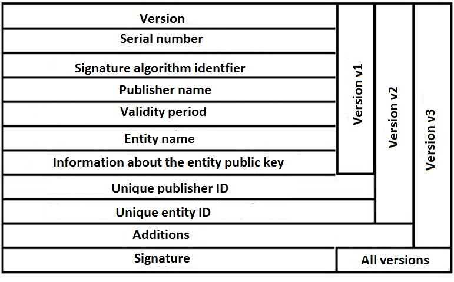

# X.509 Authentication Service

X.509 Authentication Service defines a directory service and a framework that
provides [Authentication](202210040915.md)# services to its users. The directory
is a server or in distributed architecture, a set of servers that maintains a
database that stores user information. It can also serve as a repository of
[Public-Key Certificates](202210122233.md)# which contain the public-key of a
user and signed with the private key of a trusted CA (Certification Authority).

The format for X.509 Certificate is shown as follows:

Where:
- *Version* is the version of the certificate format
- *Serial number* is a unique integer value within the CA
- *Signature algorithm identifier* is the algorithm used to sign the certificate
  together with any associated parameters
- *Publisher name* is the name of the CA who issues this certificate
- *Validity period* defines the first and last date on which the certificates is
  valid
- *Entity name* is the name of the user whom this certificate refers
- *Information about the entity public key* refers to the user's public key and
  an identifier of the algorithm that will use the key, together with any
  associated parameters
- *Unique publisher ID* is an optional bit string field used to identify the CA
- *Unique entity ID* is an optional bit string field used to identify the user
- *Extensions* define a set of one or more extension fields used by version 3
- *Signature* is the hash code of the other fields including the signature
  algorithm identifier which is encrypted by CA's private key

The certificate can also be expressed as the notation shown below:

$$
CA «A» = CA \{ V, SN, AI, CA, T_A, A, Ap \}
$$

Where:
- $Y«X»$ denotes a certificate of user X issued by CA Y
- $Y{I}$ denotes the signing of I by Y with an appended, encrypted hash code
- $CA$ is Publisher name
- $V$ is Version
- $SN$ is Serial number
- $AI$ is Signature algorithm identifier
- $T_A$ is Validity period
- $A$ is Entity A's name
- $A_p$ is A's public key

The certificates generated by CA can only be modified by CA without being
detected. Other than that, any user with access to the CA's public key can
verify the user public key that was certified by the certificate. The
certificate could be revoked due to *potential compromised user's private key*
(assumption), *potential compromised the certificate* (assumption), or the user
is *no longer certified*.

It is widely used in [Secure/Multipurpose Internet Mail Extensions (S/MIME)](202211012139.md),
[IP Security (IPsec)](202210052208.md)#, and SSL/TLS.
