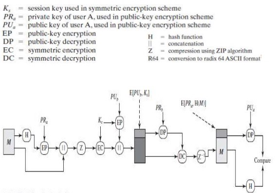

# Pretty Good Privacy (PGP)

PGP is a #[Asymmetric Cryptographic](202203221212.md) program used to encrypt,
decrypt and sign emails over insecure transmission channel such as Internet with
[Digital Signature](202210040909.md)# which is developed by Philip R. Zimmermann
in 1991. It has become the de facto #[standard](202210022253.md) for email
security. It provides five services: [Confidentiality](202210022150.md)#,
[Authentication](202210022151.md)#, compression, e-mail compatibility (encode
raw binary to ASCII characters using [Radix-64 Encoding](202211012129.md)#) and
segmentation (if the message is too large). It guarantees the security in
[Application Layer](202206131856.md)#.

Generally, it uses four types of keys: one-time session symmetric keys, public
keys, private keys, and passphrase-based symmetric keys. The public key could be
identified using the least significant 64-bits of the key which is most likely
to be unique. It will be transmitted to the network with the key ID instead of
the whole key for efficiency's sake. The security of the private key is depended
on the passphrase.

## Process

Authentication, that is validation of the sender, is done by involving the
sender's private key $KR_a$ and public key $KU_a$, and comparing the hashed
message $H(M)$and the decrypted plaintext $M$. The confidentiality of the
message is done through the compression $Z$ and encryption of the message using
a [randomly](202207162147.md) generated session key $K_S$ (with ANSI X12.17
generator) which will be distributed together with the message encrypted by the
receiver public key $KU_b$.

The following steps show the entire process:
1. The sender creates a message
2. A [Hash Function](202112122038.md) such as SHA-1 will be used to generate a
   hash code version of the message
3. The hash code is encrypted with [Rivest-Shamir-Adleman (RSA)](202210122110.md)#
   using the sender's private key.
4. The hash code then concatenates with the plaintext message with it being the
   top of the plaintext.
5. The message is then be compressed, thus finish the authentication process and
   start the confidentiality on the sender side.
6. A random 128-bit number will be generated to be used as a one time session key.
7. The message then is encrypted using CAST-128, #[International Data Encryption Algorithm (IDEA)](202210061123.md)
   or #[Triple Data Encryption Standard (3DES)](202209012209.md) with the
   session key.
8. The session key is encrypted with [Rivest-Shamir-Adleman (RSA)](202210122110.md)#
   using the recipient public key.
9. The encrypted session key will then be prepended to the encrypted message,
   thus complete the confidentiality process on the sender side.
10. When the recipient received the encrypted PGP message, it will first decrypt
    the session key using their private key ($KR_b$) and [Rivest-Shamir-Adleman (RSA)](202210122110.md)#.
11. The recovered session key will then be used to decrypt the message.
12. The message will be decompressed, thus complete the confidentiality process
    on the recipient side.
13. The recipient uses [Rivest-Shamir-Adleman (RSA)](202210122110.md)# with
    sender's public key to decrypt and recover the hash code.
14. A new hash code is generated from the plaintext message and used to compare
    with the decrypted hash code. If two match, then message is authenticated.

