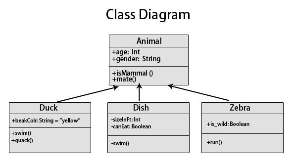

# Class Diagram

Class Diagram is a tool for illustrating the classes' structure and the
relationship between them. Classes are usually depicted as a concrete box with
name in bold, and fields and methods put below the name. Some would put abstract
class in italic but in UML the name will be put inside double square bracket
like "\<\<abstract\>\>".

