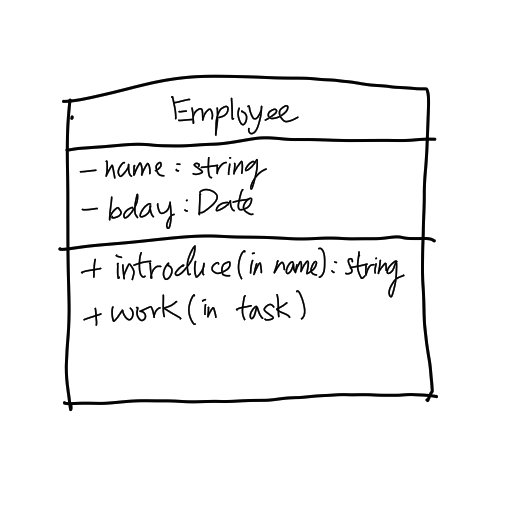
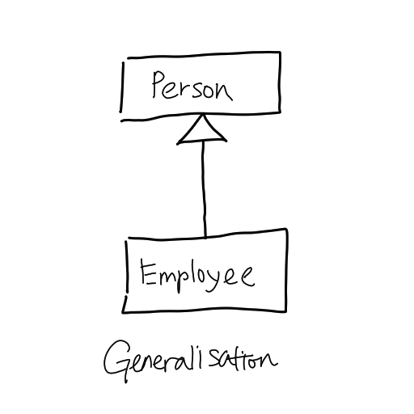
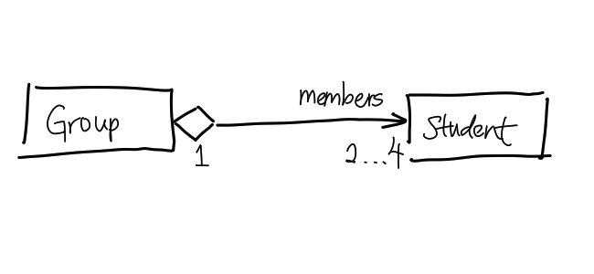
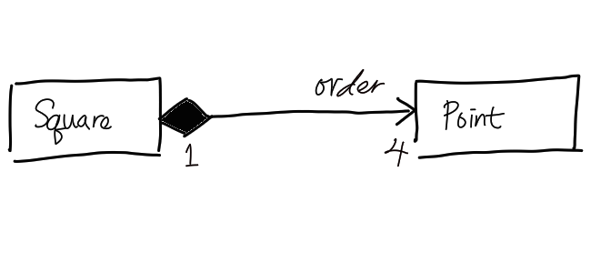

# UML Class Diagram

Class Diagram in [Unified Modelling Language (UML)](202304011211.md) is a tool
for illustrating the classes' structure and the relationship between them which
can build up a detail vocabulary of the domain. Classes are usually depicted as
a concrete box with name in bold, and fields (properties, attributes,
association) and methods (operations) put below the name. Some would put
abstract class in italic but in UML the name will be put inside double square
bracket like "\<\<abstract\>\>". Visibility of the fields and methods can be
public (+), private (-), protected (#), or package (~). Additional properties to
the field and method can be appended to the field enclosed by curly brackets {}.
To indicate the type of the parameter taken by the method, we can write it as in
(input), out (output), and inout (both).

Typical relationships can be depicted in class diagram are:
- Generalisation (inheritance, child points to the parent with a hollow triangle
  arrow)
- Aggregation (independent part-of relationship, containing class points to the
  contained class where a hollow diamond reside on the containing class)
- Composition (dependent part-of relationship, containing class points to the
  contained class where a solid diamond reside on the containing class)
- Association (a single line, may include direction on the label)

