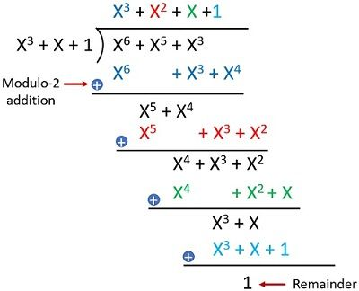

# Parity Polynomial

Parity Polynomial $b(D)$ is defined as below using several facts from
#[Cyclic Code](202212192231.md) and #[Generator Polynomial](202212192305.md):

$$
\begin{align}
x(D) &= b(D) + D^{n-k} m(D)\\
x(D) &= a(D) g(D)\\
a(D) g(D) &= b(D) + D^{n-k} m(D)\\
a(D) &= b(D) / g(D) + D^{n-k} m(D) / g(D)\\
D^{n-k} m(D) / g(D) &= a(D) - b(D) / g(D) (\mod 2)\\
D^{n-k} m(D) / g(D) &= a(D) + b(D) / g(D)\\
b(D) &= D^{n-k} m(D) \mod g(D)
\end{align}
$$

[Modulus](202210090858.md) $g(D)$ is done by eliminating similar Ds until we
reach the lowest exponentiation using long division. Use the highest possible
degree polynomial to divide $g(D)$ using $D^{n-k} m(D)$. The long division shown
below illustrates how to do it:

Where:
- $X^3 + X + 1 = g(X)$
- $X^6 + X^5 + X^3 = X^{n-k} m(X)$
