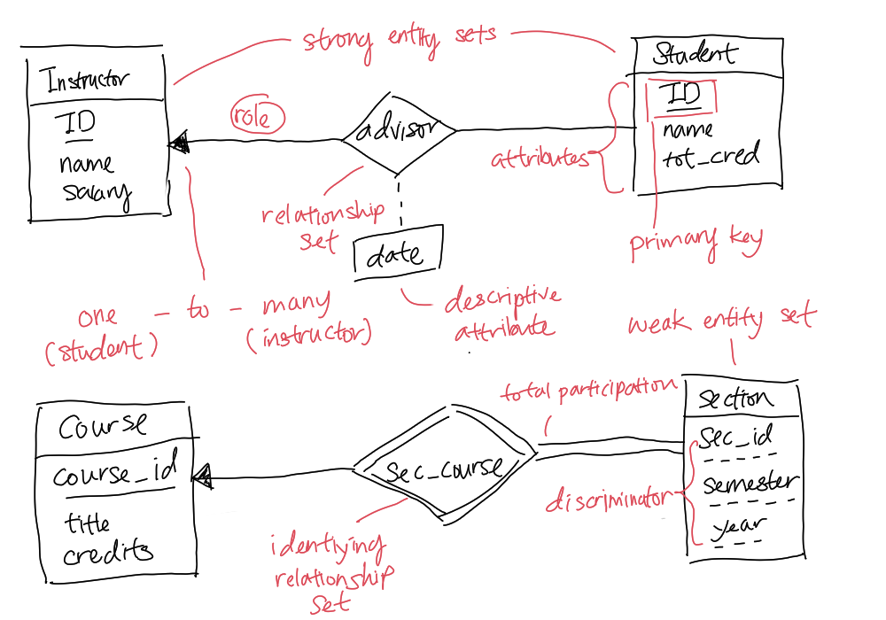

# Entity-Relationship Model (E-R)

E-R Model is a [Data Model](202302101219.md) that uses a collection of basic
objects, named [entities](202304191954.md) (represented as a table), that
represent thing in real world that is unique from other objects, and
[relationships](202304192107.md) among them. The [Attributes](202304200943.md)
of an entity are represented using columns. Furthermore, there could be mapping
cardinalities that define the number of entities can be associated in a
relationship to another entity. It could be seen as an enhancement to
[Relational Model](202302101331.md).

It is advised to not have redundant attributes in different tables and treat the
connection between two tables as a uniform relationship instead as an attribute
in one of them. The latter advice make the logical relationship clear and
unambiguous and avoid premature assumption of the [Mapping Cardinality](202304290909.md).

The following figure shows an example of constructing E-R diagram:

See [Entity Set](202304191956.md) for more description on differentiation of
strong entity set and weak entity set. Notice that mapping cardinalities could
be represented via an arrowhead line from one entity set passing through a
[Relationship Set](202304200933.md) to another entity set. In fact, we can
represent one-to-one relationship with a line with both arrowheads pointing to
both entity sets. For many-to-many relationship, we could just have a simple
single line to represent a partial participation or double line for total
participation. Additionally, we can label the *multiplicity* of the relationship
at the both end of the line in the form of $l .. m$ where $l$ is the minimum
number that an entity set can have another entity set and $m$ is the maximum.
When we label the multiplicity on one end of the line, it indicates the
cardinality of the closest end of the entity set to the opposite end.

**Note**: For nonbinary relationship, the above diagram labels might not clear
out ambiguity of the relationship between each other. The solution is the
functional dependencies to wash over any possible confusion.

In the question of choosing to build up either an entity set or with
relationship set, Silberschatz et al. [^1] suggested by designating a
relationship set to describe an action that occurs between entities.

[^1]: Database System Concepts
