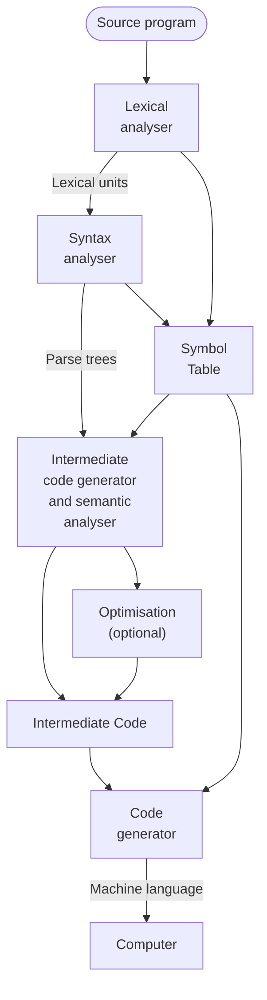

# Compiler

A Compiler consists of several components: [lexical analyser](202302281733.md),
[Syntax Analyser](202302281741.md), *intermediate code generator*, *semantic
analyser*, *symbol table*, and *code generator*. The following flowchart shows
the procedures on how the compiler compile a source language (the programming
language that the compiler translate):

Lexical analyser parses the source language into lexical units such as
identifiers, keywords, operators, punctuation symbols etc. except comments.
Then, those units passed to the syntax analyser to generate parse trees which
may or may not be constructed which is instead gathered the necessary
information then used directly. The semantic analyser will check the errors that
are hard to detect during the syntax analysing such as type checking. Symbol
table is a database for compilation that stores type and attribute information
of the user defined name.
