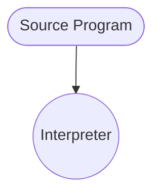

# Interpreter

Interpreter is a #software simulation of machine, often a [Virtual Machine (VM)](202204071131.md),
that decode the source program every time it is evaluated. Though such process
can be slow, it provides an easy source-level debugging as the run-time error
messages and refer to source-level units. The following flowchart shows the
its procedures:

