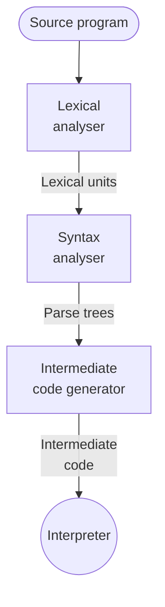

# Hybrid Implementation System

Hybrid implementation system combines both [Compiler](202302152015.md) and
[Interpreter](202302152053.md) in order to have a compromise performance on the
compilation time and execution time. This is done by translate high-level
programming language into an intermediate language that is easy to be
interpreted, which later on will be decoded once. The following flowchart shows
its procedures:

