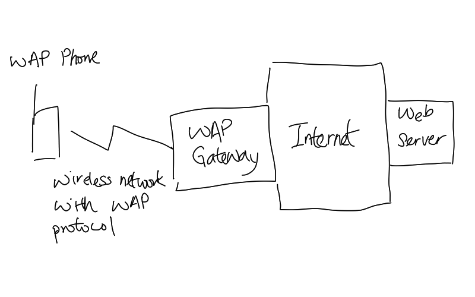

# Wireless Access Protocol (WAPv2)

WAPv2 is an open, global specification that empowers [mobile users](202303292141.md)
with [wireless](202303301607.md) devices to easily access and interact with
information and services instantly. ~~[Protocol](202209302229.md) for mobile
wireless connection~~ It is intended for data entry or display on [cellular phones](202303292214.md).
It has a complete protocol stack similar to [Internet Protocol (IP)](202206151223.md)
but optimised for wireless information pull and push [Transport Layer](202206131837.md)
and above across multiple wireless technologies.

The following figure shows a rough picture of the WAP architecture:

However, WAP technology has been made obsolete since most mobile browsers have
full compatibility to the modern web standard such as HTML.
