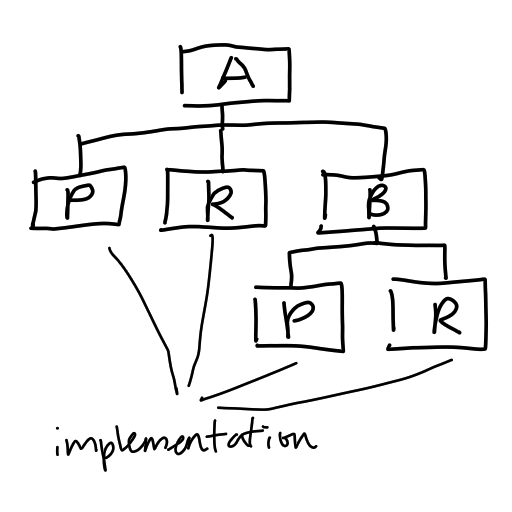

# Nested Generalisation

Nested Generalisation describes a class hierarchy where subclasses need to be
extended for different implementations. This indicates a code smell and should
be [Refactored](202206032059.md) into [Bridge Pattern](202303261633.md). The
following shows a visuliasation of such class hierachy:

