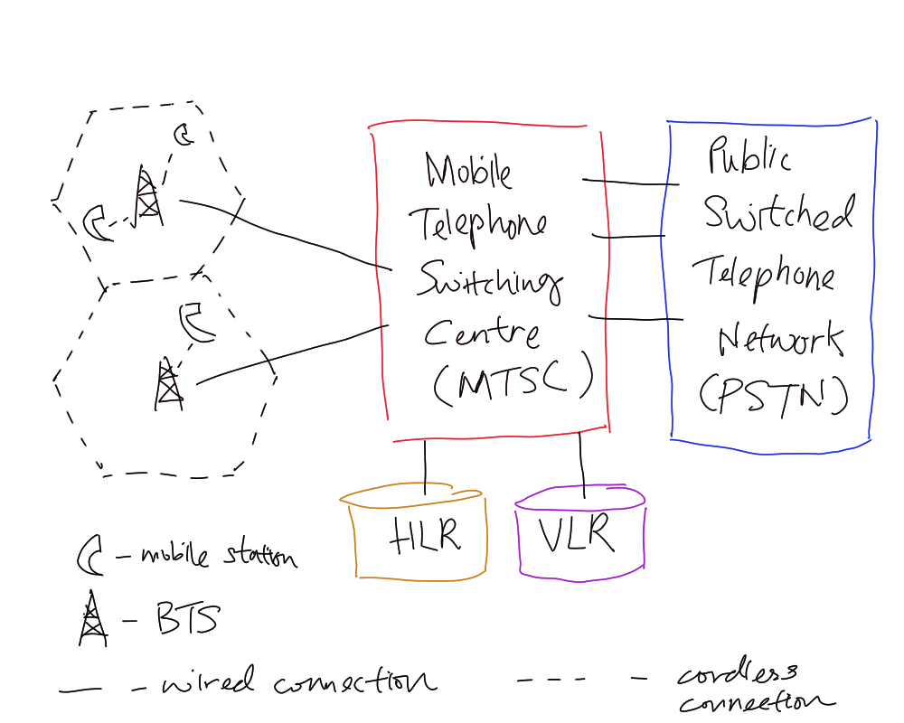

# Cellular Network

Cellular network is enabled by advancement from microprocessor (possible
implementation of complex #algorithm) and digital control links between the base
station and [mobile unit](202303292141.md) (increase control of system,
available more sophisticated services). It typically consists of Mobile
Telephone Switching Centre (MTSC) at least one [Mobile Switching Centre (MSC)](202305081828.md),
that connects to the base transceiver stations (BTSs) of the cells and Public
Switched Telephone Network (PTSN).

- [First-Generation Cellular Network (1G)](202303311218.md)
- [Second-Generation Cellular Network (2G)](202303311222.md)
- [Second and A Half Generation Cellular Network (2.5G)](202303311226.md)
- [Third-Generation Cellular Network (3G)](202303311227.md)
- [Forth-Generation Cellular Network (4G)](202303312039.md)
- [Wireless Access Protocol (WAPv2)](202302161711.md).
