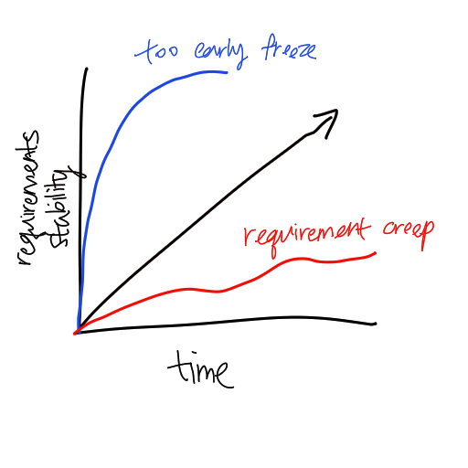

# Requirement Stability

From the graph above, we could see that there are three kinds of situation that
a development team could come into when stabilising the
[Requirements](202303251303.md). The blue line indicates **too early requirement
freeze**, which could result in unmet user needs for the final product. The red
line depicts **requirement creep**, where changes to the requirement and new
requirements are accepted even after the end of the requirement phase. Such
circumstance can cause the project to sink in more costs and time to complete a
product. An ideal situation is to have more and more stable set of requirements
over a course of time.
