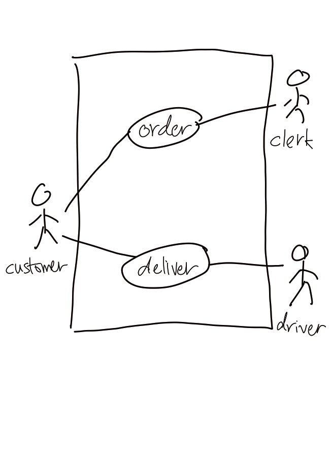

# UML Use Case Diagram

Use case diagram in [Unified Modelling Language (UML)](202304011211.md)
describes how the users interact with the [System](202303242148.md). Note that
if there is more than one use case diagram produced for a particular product, it
is often the case that the use case diagram is too specific and not general
enough. In a use case diagram, there are three entities involved: **use cases**
(sequence of actions with measurable value to an actor), **actors** (person,
orgnisation, external system), and **associations** (interaction between use
case and actor). Often time a [UML Activity Diagram](202304011422.md) will
describe exactly one use case in the diagram.

