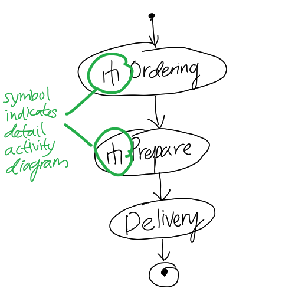

# UML Activity Diagram

Activity diagram in [Unified Modelling Language (UML)](202304011211.md) shows
the [System](202303242148.md) workflow and the interaction between the user and
the #software. It is pretty similar to flowchart. It serves as a complement to
[UML Use Case Diagram](202304011421.md) for more details, therefore there can be
multiple activity diagrams to describe exactly one use case. Eclipses represent
actions, diamonds represent decisions (a true condition with an else) or merges
(merge lines, accept multiple input with only one output), and bars represent
the start or end of tasks [concurrent execution](202202011815.md).

**Note**: Be aware of infinite loops (entry control loop and exit control loop)
that map back to the loop value initialisation.

In most cases, the activity diagram attempted to cover the whole picture of the
organisation activities could be too complex in able to be represented in a
single diagram. We can instead draw an abstract activity diagram that cover the
overall organisation activities and break them down into smaller activity
diagrams that explain the operations in detail. The following diagram shows an
example of abstract activity diagram:

