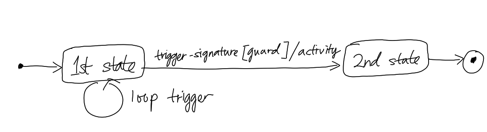

# UML State Machine Diagram

State machine diagram in [Unified Modelling Language (UML)](202304011211.md)
depicts various states and events that change the [System](202303242148.md)'s
state. There should be only one state machine diagram to describe **an entity**
response to the events. The state transition is represented by an arrow-head
line connect one state to another like shown below:

In the diagram, the transition has the label syntax of `trigger-signature
[guard]/activity`. *Trigger-signature* represents a single event that triggers a
potential change of state. *Guard* is a boolean condition (true or false) that
must be true for the transition to be happen. *Activity* is the behaviour(s)
that is executed during the state transition. Both guard and activity are
optional. As you can see from the diagram, a loop transition can be represented
by a transition line point to the state itself.
