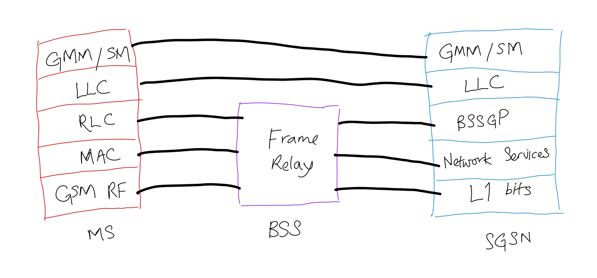

# General Packet Radio Service (GPRS)

GPRS is a [Second and A Half Generation Cellular Network (2.5G)](202303311226.md)
technology that provides packet-switched capability to
[GSM](202304111937.md)/IS-136 networks and connects them to [IP networks](202206151223.md).
It has an asymmetric downstream speed of 53.6 Kbps and upstream speed of 26.8
Kbps, and may reach the maximum bandwidth of 171.2 Kbps. The radio resources are
used only when there is a need to send or receive data, thus achieving great
spectrum efficiency. It is typically displayed as G in [mobile connection](202303292147.md).

GPRS contains several components such as [Serving GPRS Support Node (SGSN)](202404111203.md),
[Gateway GPRS Support Node (GGSN)](202404111209.md), and [Radio Network Controller (RNC)](202404111212.md).
Radio Link Control (RLC) is responsible of transferring Logical Link Control
(LLC) [Protocol Data Units (PDU)](202206131643.md) between a mobile station and
a [Basic Service Set (BSS)](202304171335.md). [Frame Relay](202208291308.md) is
deployed in order to deliver network service between SGSN and the BSS.

- [GPRS Mobility Management (GMM)](202305170918.md)
- [GPRS Session Management](202305170931.md)
