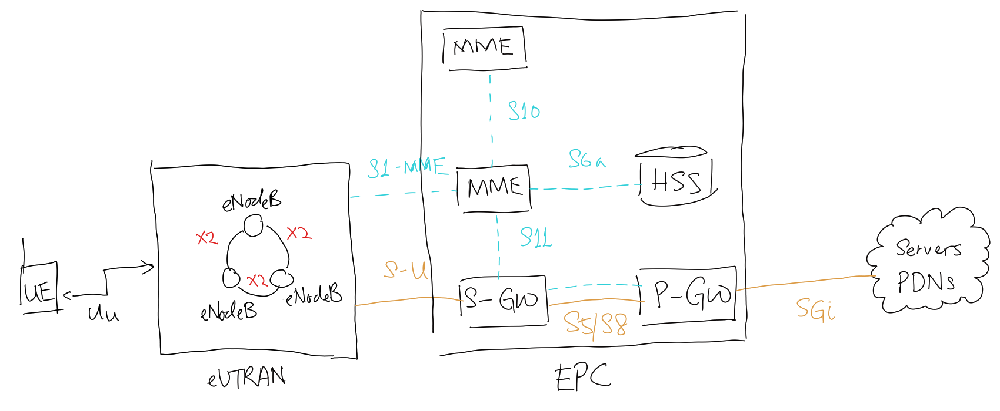

# Long-Term Evolution (LTE)

LTE is a [Forth-Generation Cellular Network (4G)](202303312039.md) technology
that utilises [Orthogonal Frequency-Division Multiple Access (OFDMA)](202303302122.md)
with a bandwidth of 30 MHz. It has an asymmetric downstream speed of 100 Mbps
and upstream speed of 50 Mbps. Its evolution LTE Advanced (LTE-A or LTE+) offers
higher downstream speed of 1 Gbps and upstream speed of 500 Mbps. Both of them
are displayed as 4G in [mobile connection](202303292147.md).

Theoretically, if extended to LTE Advanced (LTEA), it can reach peak data rates
of more than 1 Gbps.

A typical LTE topology consists of user equipment (UE), [Evolved UMTS Terrestrial Radio Access Network (eUTRAN)](202305131622.md),
[Evolved Packet Core (EPC)](202305131616.md), and Packet Data Network (PDN). The
following figure shows the detail connections including their corresponding
internal views where dashed lines indicate signal connections and solid lines
indicate wired traffic.

