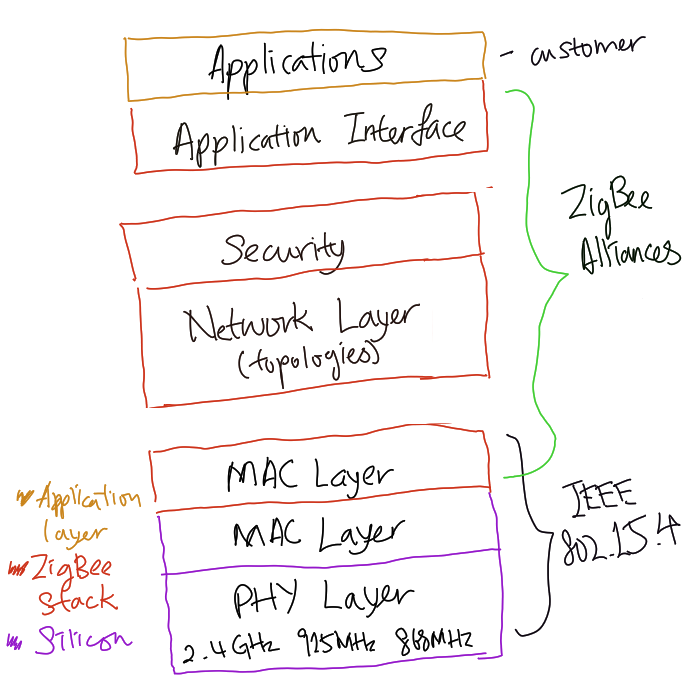

# ZigBee

ZigBee is a set of high level protocols designed for lower power, low data
rates, secure, and reliable [Wireless Personal Area Network (WPAN)](202303292149.md)
based on [IEEE 802.15.4](202304271819.md) standard. It uses 2.4 GHz band. It is
typically used in sensor networks, industrial monitoring and control (asset
tracking), home automation (smart home), personal health care, PC and
peripherals, gaming and automotive solutions, hospital care, and remote
[wireless](202303301607.md) microphone configuration.

The protocol stack, based on IEEE 802.15.4 defined [PHY Layer](202206131647.md)
and [MAC layer](202303301623.md), provides [Network Layer](202206131702.md),
security, and application interface defined by [ZigBee Alliance](202304271814.md).
The following figure shows the entirety of the ZigBee protocol stack:

Comparing to [Bluetooth](202304212236.md), it is reliable and self-healing,
supports large number of nodes (up to 65536), easy to deploy (extendable), has
very long battery life (low power requirement), secure
([128-AES](202209012213.md)), low cost, can be used globally, and has faster
network join time.
