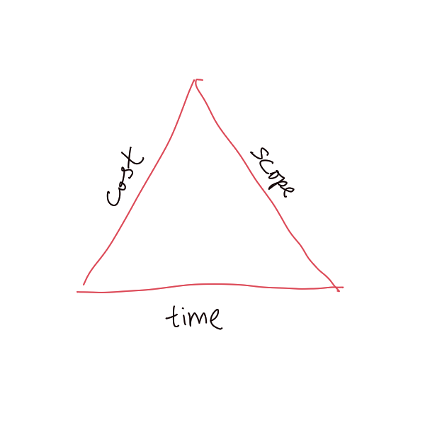

# Project Management

Project management involves actions such as deciding tasks required to complete
the [Project](202303251004.md), their schedule, and the role should be played by
each of our teammates in the project. It converts the [plan](202303251009.md)
into action and monitors the progress in order to deliver the solution on time
and on budget. The progress and the results should be informed to the clients
and managers in oral, visual, and written media form.

When managing a project, we must consider the three factors: cost, time, and
scope, which could be constructed as the triangle that will be shown below.
Changes in one factor will result in changes in other factors. Therefore, we
have to find out the fixed factor (fixed leg), the problem factor (problem leg),
and the remaining factor(s) (remaining leg).

If the problem factor is the fixed factor, we can adjust two remaining factors
accordingly. However, if the problem factor is laying somewhere, we can only
adjust the non-fixed factor, that is the one remaining factor.
