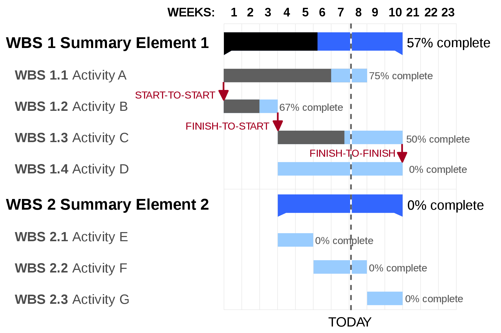

# Gantt Chart

Gantt chart is a bar chart with project activities on the left and time across
the top like the following figure:

For each activity, a bar of expected time is drawn from the scheduled starting
date to the ending date. The bar is filled in as the activities gain progresses.
It is certainly able to show visually the entire schedule for a large, complex
project, including progress to date and status, but doesn't show the
relationship between the activities.
