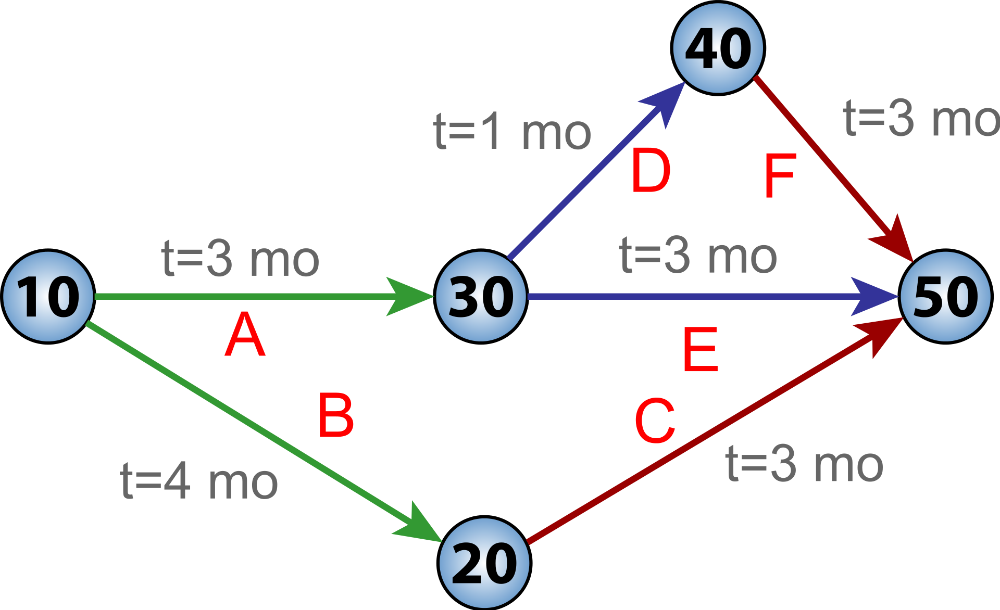
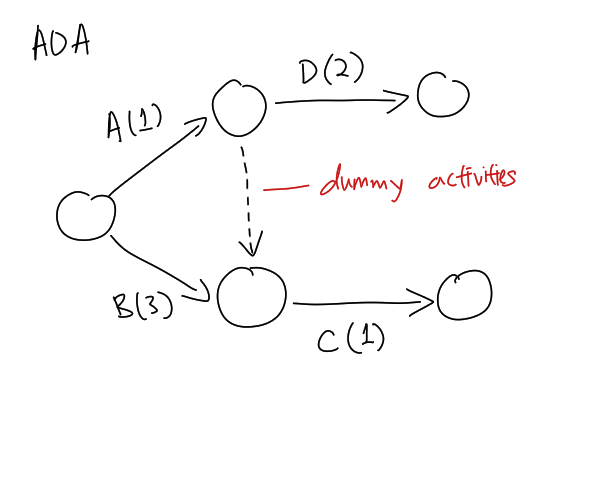
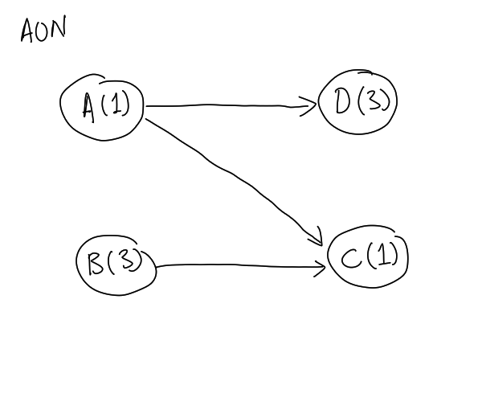

# Program Evaluation Review Technique (PERT)

PERT is a diagram that displays all the activities in a
[Project](202303251004.md) be identified along with the activities that precede
and follow them. The following figure shows an example of PERT, note that arrows
represent time and #resource [Requirement](202303251303.md) for an activity and
nodes represent its completion and initiation:

From the above diagram, we could make [Project Estimation](202305132135.md) on
completion time and find out the critical path.

In fact, we can draw PERT differently in either activity-on-arrow (AOA) and
activity-on-node (AON) as shown as in following two figures:

**Note**: A dummy activity, the dashed line, in AOA diagram weighted 0. It
should be used when an activity is the predecessors for two activities at the
same time.
