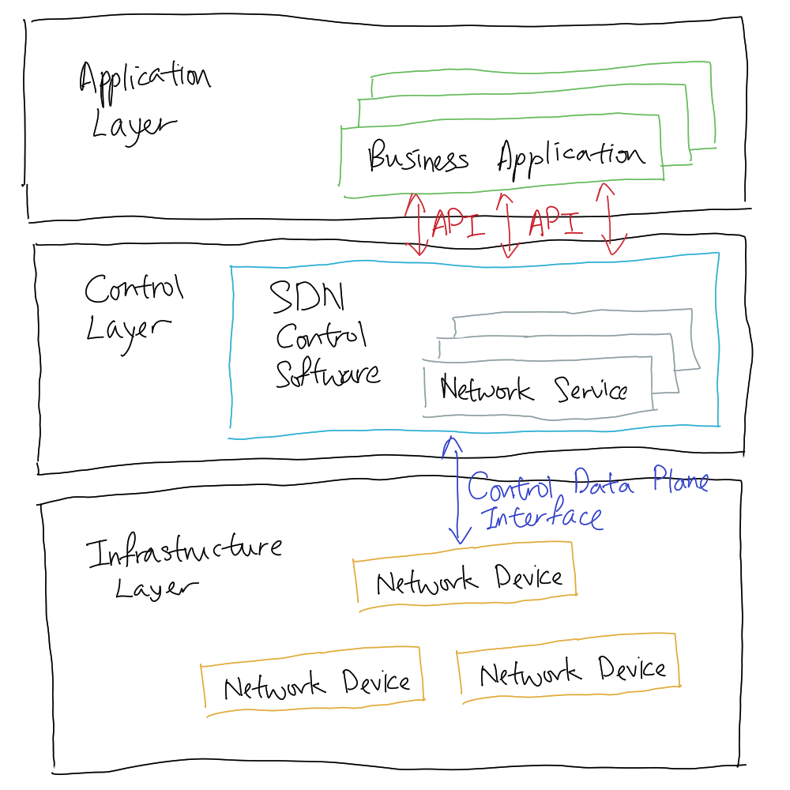
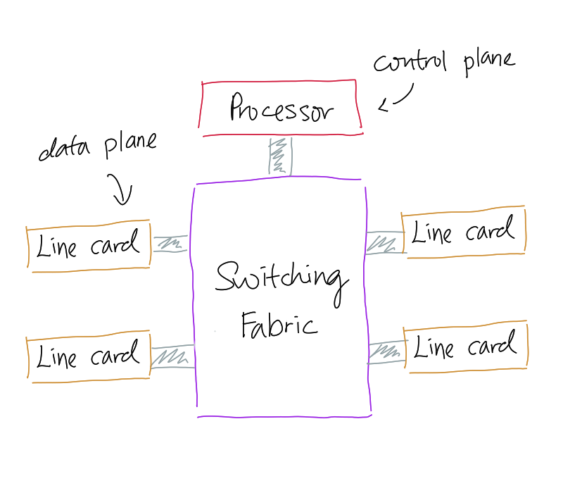

# Software Defined Network (SDN)

SDN is a new network architecture approach that enable network to be agile,
flexible, intelligently and centrally controlled using software applications. It
aims to enhance to the network #performance that allows network operator to
consistently and holistically manage the entire network, providing great network
programmability and automation. It could be understood as a concept of the
physical separation of the network control plane from the forwarding plane, and
where a control plane controls several [Network Devices](202207051821.md).

Conceptually, its architecture consists of three layers, that is **application
layer**, **control layer**, and **infrastructure layer**. Application layer
provides a space to deploy restrain function ([Intrusion Detection System (IDS)](202303081739.md),
[Firewall](202301211140.md)) or network applications ([Load Balancing](202210242151.md))
compare to traditional network that needs specialised appliance. Control layer
serves as a brain of the SDN that uses centralised SDN controller software
(deployed on a server) to manage policies and traffic flow all over the network.
Infrastructure layer is simply a layer made up from physical [Network Devices](202207051821.md).
The following figure shows the layer hierarchy and their interaction:

For control layer, there will be a controller component with *northbound* and
*southbound* interfaces with different responsibilities. Northbound interface,
connecting application layer and control layer with REST API, allows a
particular component of a network to communicate with a higher-level component
and describes the area of protocol-supported communication between the
controller and applications or higher layer [Control Programs](202305151920.md).
Examples of northbound interface are [OpenFlow](202305151926.md),
[BGP](202210242013.md), [SNMP](202212211531.md), OVSDB, and NETCONF. On the
other hand, southbound interface, connecting control layer and infrastructure
layer, allows a particular network component to communicate with a lower-level
component and enables the communication between the controller and the network
nodes, either physical or virtual, so that the [Router](202207061800.md) can
discover [Network Topology](202304211303.md), define network flows, and
implement requests delegated to it. Examples of southbound interfaces are REST
API, pyretic, Frenetic, and Procera. In a [Data Centre](202210012205.md),
northbound APIs are responsible for management solutions for automation and
orchestration, and the sharing of actionable data between systems. Southbound
APIs are responsible for the communication with the switch fabric, network
virtualisation protocols, or integration of a distributed computing network.

Corresponding to the above SDN architecture's layers, from the highest to the
lowest, it has **management plane** (consisting applications or [Control Program](202305151920.md)),
**control plane** (like [Network Operating System](202305151917.md)), and **data
plane** (network devices). The communication between the control plane and data
plane, that is the *control data plane interface*, could be established via
[OpenFlow](202305151926.md). The management plane is where the network
configuration and tuning done including [Traffic Engineering](202305040730.md),
[Access Control List (ACL)](202302190738.md) configuration, device provisioning
etc. Control plane computes the forwarding state in the routers which affect
routing, traffic engineering, and failure detection or recovery. Data plane is
responsible for processing and delivery of packets based on local forwarding
state and the packet header. Filtering, buffering, and scheduling of the packets
are done in data plane.

Using SDN, the network is programmable via external software independent of
physical devices to manage network behaviour, providing great customisation
opportunities to networks in support with new service. The control on bandwidth
management, restoration, #security, policies etc. are intelligent and
centralised for optimisation. Physical hardware and connection are logically
separated with the services and applications, and can be interacted via APIs
instead, thus making the connections between network infrastructure flexible. In
addition, SDN enables multivendor interoperability and vendor-neutral ecosystem.

[Load Balancing](202210242151.md) is beneficial to SDN as there are needs and
significance of its usage. In terms of needs, SDN have to be able to provide
better services and fulfil [Quality of Service (QoS)](202209282057.md)
[Requirements](202303251303.md). Load balancing enables SDN to improve its
performance in distributed environment by [Throughput](202304111957.md)
optimisation with low response time, efficient utilisation of network resources,
without imposing extra overhead on the network. The significance of load
balancing to SDN is that it reduces the burdens of control layer to serves
requests and services from infrastructure and application layer especially due
to increasing demand of the customers over the [Cloud Computing](202210012158.md).

There is a great need of SDN due to the ever-increasing cost and complexity of
managing growing number of devices. SDN eases network administration so that
network engineers wouldn't burn out from overworking. The abstraction of the
network view provides a holistic and logical view on the network, which open the
opportunities for thorough inspecting, monitoring, and extension. Another
benefit of abstraction is that it reduces the need of manual configuration in
which the network engineer has to set things up on the site. This minimises
human errors and makes debugging easier. From security aspect, SDN also improves
the legacy [Intrusion Detection System (IDS)](202303081739.md) since they can be
extremely slow in their own job.
