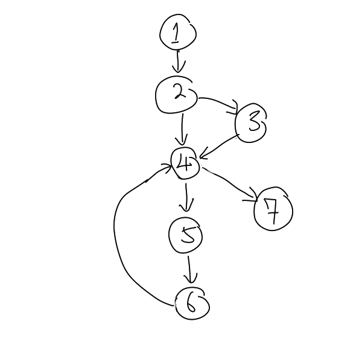

# Basis Path Testing

Basis path testing is a graph-based approach of [White Box Testing](202305202159.md)
that do comparison testing, equivalence partitioning, and boundary value
analysis. The test cases are derived to exercise the basis test are guaranteed
to execute every statement in the program **at least once** during testing. It
enables the test case designer to derive a logical complexity measure of a
procedural design (the minimum number of required test cases) and use this
measure as a guide for defining a basis set of execution paths. However, it
can't test the loop, thus needs the help from [Control Structure Testing](202305211134.md).

Let say we have the following pseudocode:

```
1   bool membership
2   float total
3   GET cart

4   IF membership == true
5       THEN discount = 15
6   ENDIF

7   DO IF cart <> empty
8       GET cart_item
9       cart_item = ...
10       total = ...
11   ENDDO

12   SHOW total
```

We can group them into 7 nodes: *node 1* contains line 1 to 3, *node 2* contains
line 4, *node 3* contains 5 and 6, *node 4* contains line 7, *node 5* contains
line 8 to 10, *node 6* contains line 11, and *node 7* contains line 12. Then,
based on its control structure, we can draw a flow graph shown as below:



Determining the cyclomatic complexity can help in finding the minimum number of
basis set of linearly independent and unique paths. The formula for the
cyclomatic complexity is as follows:

$$
V(G) = \text{Number of edges} - \text{Number of nodes} + 2
$$

**Note**: When identifying the paths, always try new node for each path.
