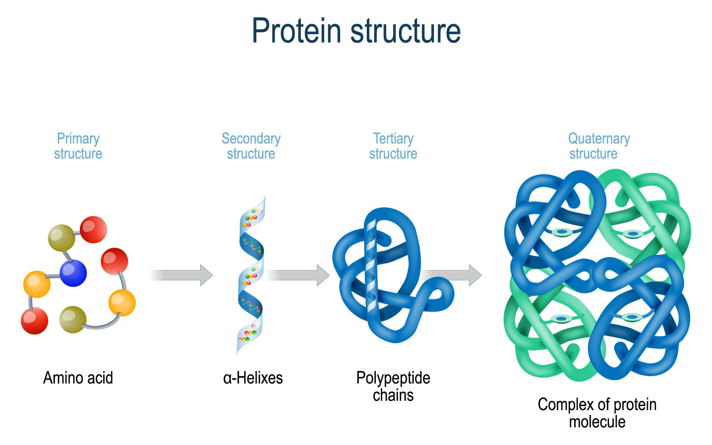

# Amino Acid

Amino acid is the monomer unit or foundation of protein. Protein performs
different biological activities and is responsible for an individual's traits
such as eye colour, body height etc. It could be [folded](202308091333.md) into
different structure (**primary**, **secondary**, **tertiary**, and
**quaternary**) to carry out different protein functions.

**Note**: As shown in the above figure, the primary structure of protein appear
as a linear object.
