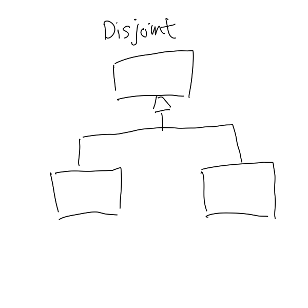
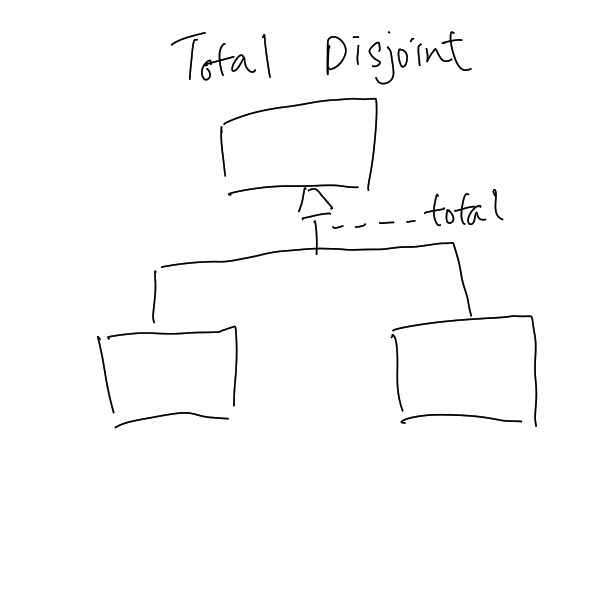
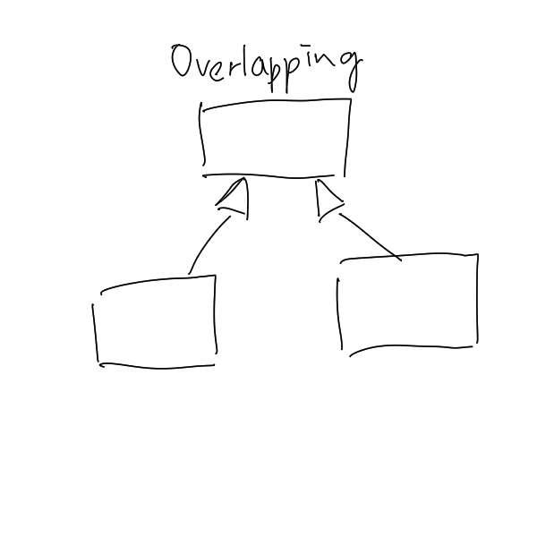

# Specification and Generalisation

Specification is a [Relationship](202304192107.md) that breaks an [Entity Set](202304191956.md)
into several entity subgroups, each with distinct and specialised feature(s). In
contrast, generalisation combines similar entity subgroups into a single common
entity set. Both display the same kind of object hierarchy, thus it is not
distinguished in [Entity-Relationship Model (E-R)](202302101334.md). Either
case, lower-level entity set inherits attributes and relationship participation
from its parent.

The hierarchy could be displayed as **disjoint** or **overlapping**. Disjoint
relationship shows that at most one parent entity set in which the lower-level
entities can belong to. Overlapping relationship, on the other hand, allows
multiple entity sets an entity may belong to. The membership of the hierarchy
could be controlled with **condition-defined** or **attribute-defined**
constraint, or **user-defined** constraint. Condition-defined constraint uses
[Attribute](202304200943.md) to determine one's membership, whereas user-defined
constraint is defined by the client individually which is implemented by an
operation that adds an entity to an entity set. There is also a completeness
constraint: **total** or **partial**. Total specification or generalisation
specified that all high-level entities must belong to its lower-level
counterpart(s). Partial specification or generalisation allows some high-level
entities to not belong to lower-level entities.

**Note**: The completeness constraint also affects the insertion and deletion
requirement for lower-level and higher-level entities.

Specification or generalisation could be represented in [Relational Model](202302101331.md)
by having lower-level entity primary key as foreign key, referencing
higher-level entity set's primary key. This simplifies relationship constraints,
reduces storage requirements, and lessen redundancy comparing to other
alternatives.
