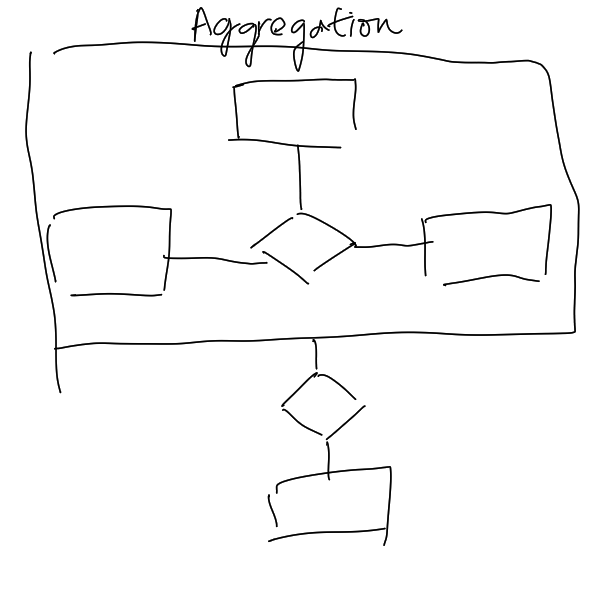

# Aggregation

Aggregation is an abstraction through which [Relationship](202304192107.md) is
treated as higher-level [Entities](202304191954.md). It could be shown in
[Entity-Relationship Model (E-R)](202302101334.md) like the following diagram.

In [Relational Model](202302101331.md), it should be treated like any other
[Entity Set](202304191956.md).
