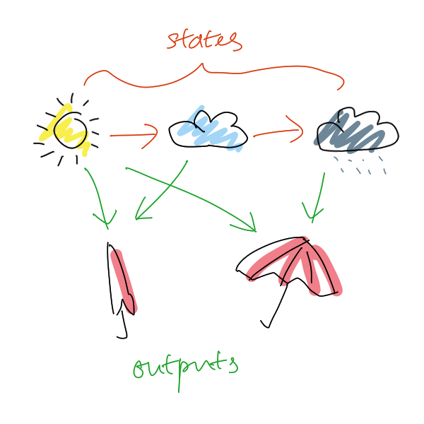

# Markov Chain

Markov chain consists a chain of probable states with its probability to occur
and their corresponding probable observable outputs. It is a great visualisation
to [Markov Model](202309071659.md) and [Hidden Markov Model (HMM)](202309071705.md).
The following picture shows three states, that is sunny, cloudy, and rainy, with
two outputs, that is without umbrella and with umbrella:

We can convert this into two matrices. The first matrix consists of its
probability of occurrence of the current state based on the previous state in
**memoryless** fashion. The second matrix consists of the corresponding
probability of an output against the current state.
