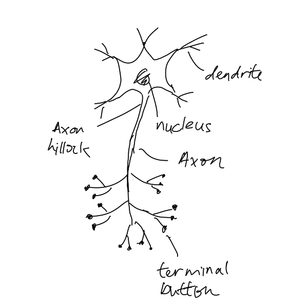
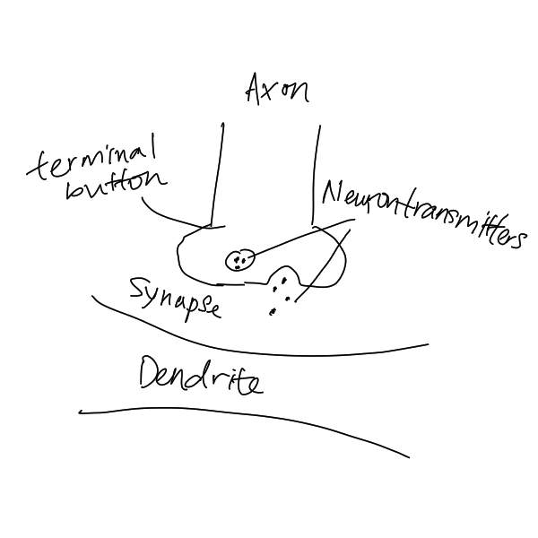

# Neuron

Neuron acts like a simple processor, utilising biochemical reactions to
receive, process and transmit information. Its anatomy is shown below:

Each terminal button connects to other neuron across a synapse, a small gap
between axon and dendrite. Dendrite tree will wait to receive neighbour neurons'
fired positive or negative charges, in which the neuron later will run a spatial
and temporal summation to add up all charge's strength. This process involve a
diffusion of chemicals called neurotransmitters.
