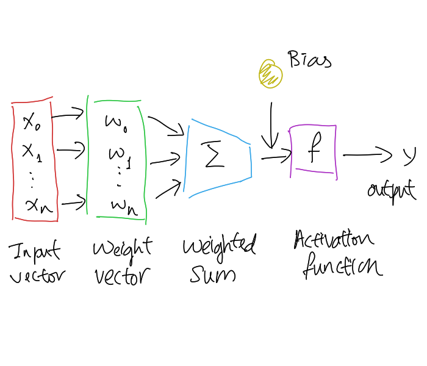

# Artificial Neuron

Like [biological neuron](202309091308.md), artificial neuron takes one or more
weighted inputs to produce an output via summation. The weight is used to modify
the input's strength, therefore act like a synapse in biological neuron. The
following shows a general logical view of an artificial neuron:

From the picture above, we can see that weight is a connection that connects
preceding neuron to output neuron, and has value which is refined on each
learning iteration to fit the model. Bias or threshold is used to shift
activation function curve which could be helping in system learning.

The total synaptic input can be computed using the following formula:

$$
u_k = \sum_{i=1}^I w_{ki} x_i - \theta_k
$$

Where:
- $\theta$ denotes bias

From here, we can get the output signal $y_k$:

$$
y_k = \Phi_k (u_k)
$$

Where:
- $\Phi$ is the activation function. There are several types of functions to be
  considered, which are threshold, ramp, sigmoid, and hyperbolic tangent type.

$$
\begin{align}
\text{Threshold: }& \Phi(u) = \begin{cases}
                                1.0 & u > 0 \\
                                0.0 & \text{otherwise}
                              \end{cases}\\
\text{Ramp: }& \Phi(u) = \text{ max}\{ 0.0, \text{ min}\{ 1.0, u + 0.5 \}\}\\
\text{Sigmoid: }& F(x) = \frac{1}{1 + e^{-x}}\\
\text{Hyperbolic Tangent: }& F(x) = \frac{e^{2x}-1}{e^{2x}+1}
\end{align}
$$
