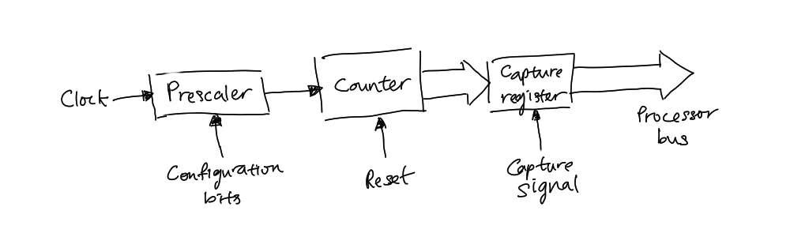

---

tags: [time, hardware]
---

# Timer

Timer is a specialised clock to measure time interval. It could be seen as a
scheduling of an event according to a predefined time value in the future. Its
main component is a free-running binary [Counter](202404061109.md), which often
connected to capture register. The capture register automatically loads the
current output of the free-running counter upon occurrence of some event,
usually a signal to an input pin. It then latches the value to a
processor-visible register, later used to generate an output signal. The
following figure shows the design of such timer:

Timer can be either [hard timers](202405251400.md) or [soft timers](202405251401.md).

The initialisation of a timer starts with the reset of the timer chip into a
known hardware state. The proper value to obtain the desired timer interrupt
frequency is calculated and programmed into the appropriate timer control
register. Other timer control registers that are related to the earlier
interrupt frequency, depends on the timer chip (reference manual), are
programmed with correct values. The initialisation process programs the timer
chip with the proper mode of operation and then installs the timer
[Interrupt Service Routine (ISR)](202405222040.md) into the system. After all
these processes, the timer interrupt can be finally be enabled.
