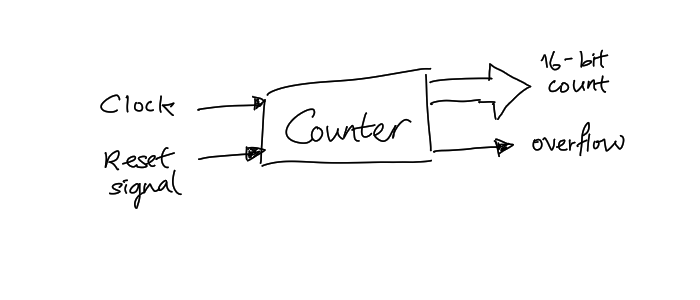

# Counter

Counter counts the number of external events' occurrence on external event pin.
If the event is clock pulse, then there is no difference between a
[Timer](202404061106.md) and a counter. The following shows an example
configuration of a counter:

