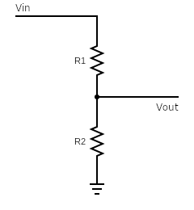

# Voltage Divider Circuit

The following image shows the construction of a simple voltage divider circuit:

We can calculate $V_{\text{out}}$ with the following formula:

$$
V_{\text{out}} = V_{\text{in}} \frac{R_2}{R_1 + R_2}
$$

Voltage ratio can be derived from this circuit with the following formula:

$$
\frac{V_{\text{out}}}{V_{\text{in}}} = \frac{R_2}{R_1 + R_2}
$$
